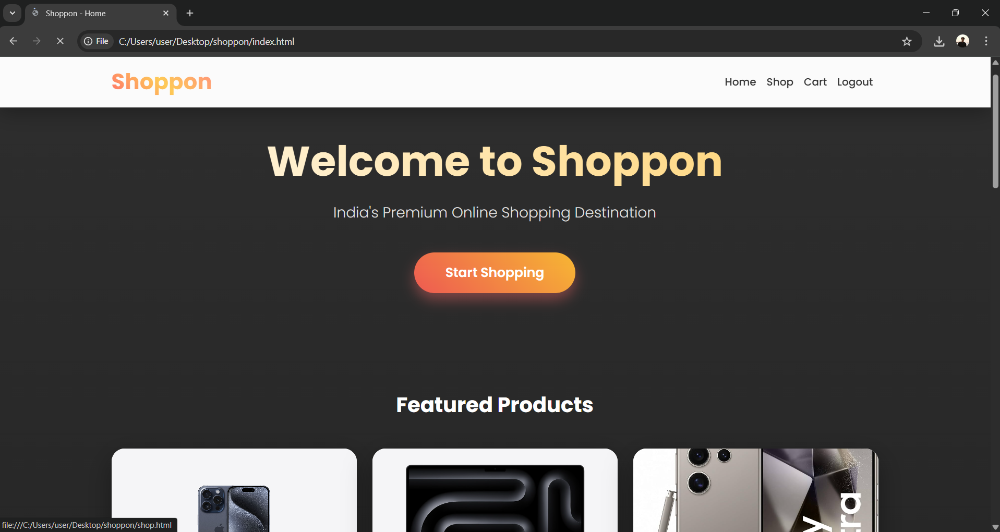
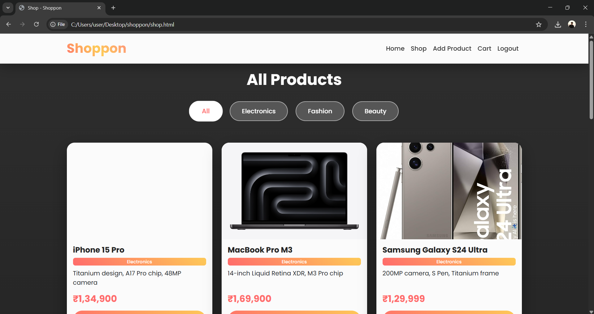
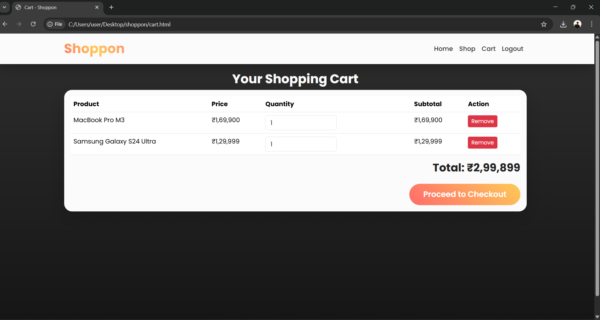
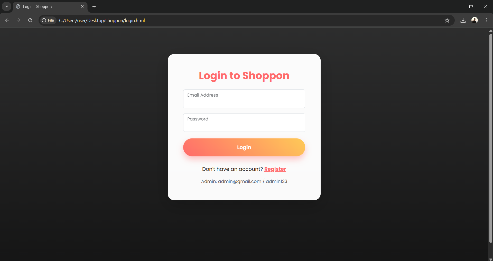
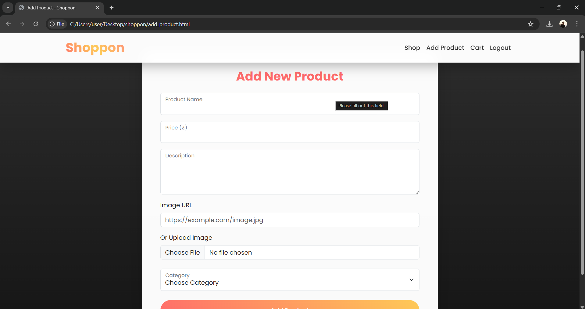
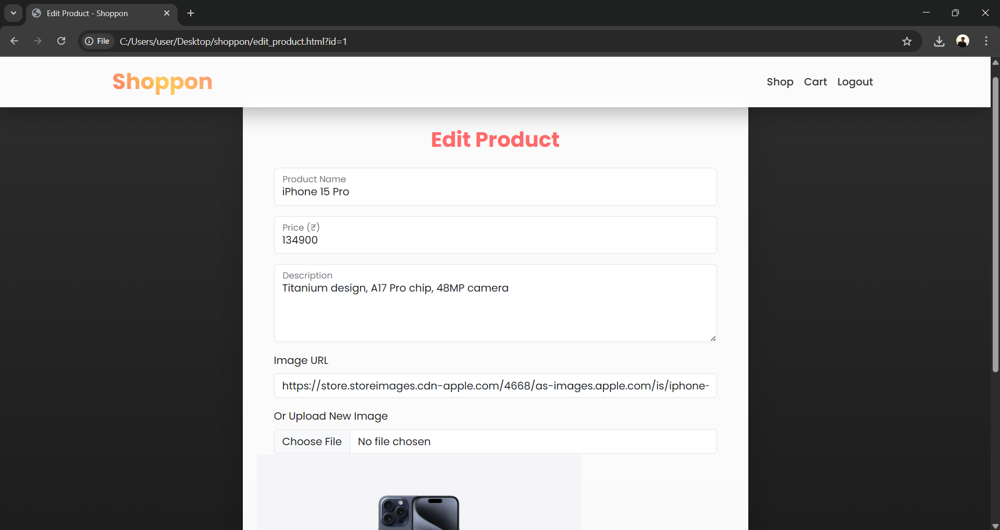

# Shoppon – Full-Stack E-Commerce Website (HTML, CSS, JavaScript + LocalStorage)

A **fully functional, responsive, and beautiful** online shopping website built using **only frontend technologies** — no backend/server required!


**GitHub:** https://github.com/AkashSabu-17/shoppon

---

### Project Overview

Shoppon is a complete e-commerce platform with user authentication, product management, shopping cart, and admin panel — all powered by **HTML, CSS, JavaScript** and **localStorage**.

**Indian Rupees (₹)** | Real Images | Image Upload + URL | "Already in Cart" Feature | Admin CRUD

---

### Pages & Their Functionality

| Page               | Purpose & Features |
|--------------------|---------------------|
| `index.html`       | **Homepage** – Hero section, featured products grid, navigation bar |
| `login.html`       | User & Admin login form with validation |
| `register.html`    | New user registration with password confirmation |
| `shop.html`        | **Main Shop** – All products with category filters (Electronics, Fashion, Beauty) |
| `cart.html`        | Shopping cart with quantity update, remove item, total calculation |
| `add_product.html` | **Admin Only** – Add new product (name, price, description, image upload or URL, category) |
| `edit_product.html`| **Admin Only** – Edit existing product (supports both file upload and URL) |

---
## Screenshots

| Home Page | Shop Page | Shopping Cart |
|-----------|----------|-------------|
|  |  |  |

| Login | Add Product (Admin) | Edit Product (Admin) |
|-------|---------------------|------------------------|
|  |  |  |


### CRUD Operations (Admin Only)

Admin Email: `admin@gmail.com`  
Admin Password: `admin123`

| Operation | Description | Page |
|---------|-----------|------|
| **Create** | Add new product with image (upload or URL) | `add_product.html` |
| **Read**   | View all products with real images and details | `shop.html` |
| **Update** | Edit product name, price, description, image, category | `edit_product.html?id=xx` |
| **Delete** | Permanently delete a product (with confirmation) | `shop.html` (Delete button) |

All CRUD operations use `localStorage` for persistent data.

---

### Bootstrap 5 Components Used

| Component                  | Usage |
|----------------------------|-------|
| Navbar (fixed-top)         | Responsive navigation with brand and links |
| Cards                      | Product display with image, title, price, button |
| Forms + Form-Floating      | Login, Register, Add/Edit Product forms |
| Buttons (btn-primary, btn-warning, btn-danger) | Actions (Add to Cart, Edit, Delete) |
| Badges                     | Product category tags |
| Alerts (Custom Snackbar)   | Success/Error notifications |
| Grid System (row, col-md-6, col-lg-4) | Responsive product layout |
| Table (responsive)         | Cart items display |
| Modal (not used – custom alerts instead) | — |

---

### Material Design / Modern UI Elements Used

| Feature                     | Implementation |
|-----------------------------|----------------|
| Gradient Backgrounds        | Hero section & body overlay |
| Glassmorphism Navbar        | Blur effect + semi-transparent |
| Card Hover Animations       | Lift + shadow + image zoom |
| Gradient Buttons            | Primary buttons with hover scale |
| Poppins Font (Google Fonts) | Clean modern typography |
| Custom Snackbar Alerts      | Floating success/error messages |
| Image Preview in Edit Form  | Real-time preview before save |
| Category Pills              | Stylish filter buttons with active state |

---

### Login & Registration Workflow

#### Registration (`register.html`)
- User enters: Name, Email, Password, Confirm Password
- Validation:
  - Password ≥ 6 characters
  - Passwords must match
  - Email must be unique
- On success → Redirect to `login.html`

#### Login (`login.html`)
- Enter registered email and password
- Special admin account:  
  **Email:** `admin@gmail.com`  
  **Password:** `admin123`
- On successful login → Redirect to `index.html`
- `localStorage.setItem('loggedInUser', email)` used for session

#### Authentication Flow
- All pages except `login.html` and `register.html` check:
  ```js
  if (!localStorage.getItem('loggedInUser')) → redirect to login